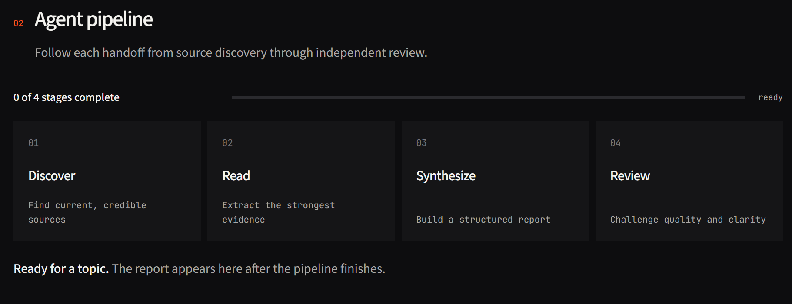

# Research Mind

> An inspectable multi-agent research system that turns one focused question
> into a sourced report and an independent quality review.

[](https://researchmind-7.streamlit.app)

**[Launch the live application](https://researchmind-7.streamlit.app)** ·
**[View the architecture](#architecture)** ·
**[Run locally](#local-development)**



Research Mind coordinates specialized LangChain agents and LCEL chains across
four explicit stages: source discovery, evidence extraction, report synthesis,
and independent review. Its Streamlit interface exposes each operational
handoff in real time, preserves completed work when a later stage fails, and
exports the finished analysis as Markdown.

## Table of contents

- [Why Research Mind](#why-research-mind)
- [Product capabilities](#product-capabilities)
- [How it works](#how-it-works)
- [Architecture](#architecture)
- [Technology](#technology)
- [Project structure](#project-structure)
- [Use the hosted application](#use-the-hosted-application)
- [Local development](#local-development)
- [Testing](#testing)
- [Pipeline API](#pipeline-api)
- [Reliability and security](#reliability-and-security)
- [Troubleshooting](#troubleshooting)

## Why Research Mind

Most research assistants show only the final answer, which makes source quality,
pipeline failures, and intermediate decisions difficult to inspect. Research
Mind presents the workflow as a visible sequence of specialized stages with a
typed state contract and structured progress events.

This project demonstrates:

- multi-agent orchestration with clear boundaries between responsibilities;
- LCEL composition for deterministic writer and critic chains;
- observable execution without exposing private model reasoning;
- failure-aware product design that retains completed intermediate output;
- a responsive, custom Streamlit interface with persistent session state; and
- deployment-ready dependency and secret management.

## Product capabilities

- **Live execution trace** — see Discover, Read, Synthesize, and Review progress
  as the pipeline runs.
- **Current web research** — retrieve up to five relevant sources through
  Tavily, including titles, URLs, and snippets.
- **Focused evidence extraction** — select the strongest result and turn the
  source page into clean, bounded text.
- **Structured synthesis** — generate a professional Markdown report with an
  introduction, key findings, conclusion, and sources.
- **Independent critique** — score the report out of ten and surface strengths,
  gaps, and a concise verdict.
- **Recoverable failures** — retain prior stage outputs if a provider or page
  fails later in the run.
- **Session persistence** — keep completed results across Streamlit reruns.
- **Portable output** — download the report and critic assessment as Markdown.
- **Credential-aware controls** — disable execution and identify missing keys
  before a request can fail.

## How it works

| Stage | Component | Responsibility | Output |
| --- | --- | --- | --- |
| 01 · Discover | LangChain search agent | Find current, relevant sources | Titles, URLs, and snippets |
| 02 · Read | LangChain reader agent | Select and extract the strongest source | Clean source text |
| 03 · Synthesize | LCEL writer chain | Combine discovery and extracted evidence | Structured Markdown report |
| 04 · Review | LCEL critic chain | Challenge evidence, structure, and clarity | Score and actionable critique |

The workflow is sequential by design: every stage consumes the previous stage's
output. The UI receives operational status events while the orchestration layer
remains reusable from Python or the command line.

## Architecture


`run_research_pipeline` owns orchestration and returns a typed `ResearchState`.
An optional callback receives `running`, `complete`, and `error` events for each
stage. Streamlit uses those events to update the pipeline rail and cache partial
outputs in `st.session_state`.

## Technology

| Layer | Technology |
| --- | --- |
| Application | Python 3.14, Streamlit |
| Agent orchestration | LangChain agents, LCEL |
| Language model | Groq `openai/gpt-oss-120b` |
| Search | Tavily Search API |
| Extraction | Requests, Beautiful Soup, lxml |
| State and validation | Typed dictionaries, Streamlit session state |
| Dependency management | `uv`, `pyproject.toml`, `uv.lock` |
| Verification | `unittest`, Streamlit AppTest |

The model name contains `openai`, but inference runs through Groq. The
application does **not** require an `OPENAI_API_KEY`.

## Project structure

```text
research-mind/
├── ui/
│   ├── __init__.py
│   └── app.py              # Streamlit product interface
├── src/
│   ├── agents.py           # Agent and LCEL chain factories
│   ├── pipeline.py         # Typed orchestration and progress events
│   └── tools/
│       ├── search_api.py   # Tavily search tool
│       └── web_scraper.py  # Bounded source extraction tool
├── tests/
│   ├── test_app.py         # UI state and rendering tests
│   └── test_pipeline.py    # Pipeline contract and failure tests
├── docs/assets/            # README media
├── .python-version
├── pyproject.toml
└── uv.lock
```

## Use the hosted application

Open **[researchmind-7.streamlit.app](https://researchmind-7.streamlit.app)**.

1. Enter a focused question. Include a timeframe, comparison, or evidence
   standard when it matters.
2. Select **Run research**.
3. Follow the four-stage execution trace.
4. Review the sourced report and the separate critic assessment.
5. Inspect the discovery and extraction outputs, then download the result.

Provider credentials are configured in the deployment. No key should be pasted
into the application interface.

## Local development

### Prerequisites

- Python 3.14
- [`uv`](https://docs.astral.sh/uv/)
- a [Groq API key](https://console.groq.com/keys)
- a [Tavily API key](https://app.tavily.com/)

### 1. Clone and install

```bash
git clone https://github.com/Vansh-7/research-mind.git
cd research-mind
uv sync --locked
```

`uv sync --locked` reproduces the dependency versions recorded in `uv.lock`
and fails instead of silently changing the lockfile.

### 2. Configure environment variables

Create a `.env` file in the repository root:

```dotenv
GROQ_API_KEY=your_groq_key
TAVILY_API_KEY=your_tavily_key
```

| Variable | Used for | Required |
| --- | --- | --- |
| `GROQ_API_KEY` | Search and reader agents, report writer, critic | Yes |
| `TAVILY_API_KEY` | Current web source discovery | Yes |

`.env` and `.streamlit/secrets.toml` are excluded from version control. The UI
still renders without credentials, but research execution remains disabled and
the missing configuration is shown to the user.

### 3. Start the Streamlit application

```bash
uv run streamlit run ui/app.py
```

Open the address printed by Streamlit, normally `http://localhost:8501`.

### 4. Run from the command line

The orchestration layer also works without Streamlit:

```bash
uv run python -m src.pipeline
```

Enter a topic at the prompt. The command prints the completed report after all
four stages finish.

## Testing

```bash
uv run python -m unittest discover -s tests -v
```

The suite uses stubbed agents and makes no calls to Groq, Tavily, or external
websites. It verifies:

- pipeline order and the returned state contract;
- running, completed, and failed event emission;
- blank-topic validation and per-stage error attribution;
- credential-aware UI behavior and session-persistent results;
- critic score parsing and Markdown export generation.

## Pipeline API

```python
from src.pipeline import PipelineEvent, run_research_pipeline


def handle_event(event: PipelineEvent) -> None:
    print(event["stage"], event["state"], event["message"])


result = run_research_pipeline(
    "How are small language models changing on-device AI?",
    on_event=handle_event,
)

print(result["report"])
print(result["feedback"])
```

Each event follows this contract:

```python
{
    "stage": "search",      # search | reader | writer | critic
    "state": "complete",   # running | complete | error
    "message": "Source discovery complete.",
    "output": "...",       # included when a stage completes
}
```

Events contain operational status and completed output. They do not expose
private model reasoning or chain-of-thought.

## Reliability and security

- Required credentials are checked before execution and their values are never
  rendered in the UI.
- Provider secrets remain in local environment variables or Streamlit Secrets.
- The scraper uses an eight-second timeout, checks HTTP status, removes common
  layout elements, and caps extracted content at 4,000 characters.
- Every stage emits an error event before an exception returns to the UI.
- Completed intermediate output remains available after downstream failures.
- Groq calls share a process-wide throttle, use bounded prompts and completions,
  and retry transient failures before showing a clear cooldown message.
- User-visible model output is escaped or rendered through Streamlit's Markdown
  components; operational logs do not reveal hidden model reasoning.

Generated research can still contain incomplete or incorrect claims. Review
the original sources before using a report for consequential decisions.

## Troubleshooting

| Symptom | Resolution |
| --- | --- |
| **Run research** is unavailable | Enter a research question first. If the button remains unavailable, refresh the page and try again later. |
| A stage is taking longer than expected | Research time depends on source availability and provider response times. Keep the page open while the live pipeline is active. |
| A source cannot be read | Some websites block automated access or require JavaScript. Retry the run so the system can select a different source. |
| The report is too broad or incomplete | Ask a narrower question and include the timeframe, region, comparison, and evidence standard you need. |
| A run stops before completion | Review the displayed error, inspect any preserved work, and retry. Temporary source or provider failures often resolve on a later run. |
| The downloaded report does not appear | Check the browser's download permissions and downloads folder, then select **Download report** again. |
